# Project Repository Analysis

**UUID:** 550e8400-e29b-41d4-a716-446655440000

---

## 1. Project Objective Analysis

### Core Purpose

Neural Plugin System with Chain Builder - A modern, web-based application featuring a dynamic plugin system with visual chain building capabilities, built with FastAPI and Pydantic. The system provides manifest-driven plugin architecture with automatic discovery, runtime loading, visual workflow composition, and **container orchestration for advanced service-based plugins**.

### Primary Functionalities

- **Dynamic Plugin Loading**: Runtime plugin discovery and loading without application restart
- **Visual Chain Builder**: Drag-and-drop interface for creating complex workflows  
- **Manifest-Driven UI**: Self-describing plugin components via JSON manifests
- **Type-Safe I/O**: Pydantic validation for all plugin inputs and outputs
- **Chain Management**: Save, load, duplicate workflows with execution history
- **Plugin Compliance**: Automatic validation of plugin response model requirements
- **File-Based Operations**: Upload/download capabilities for plugins
- **Analytics Dashboard**: Usage tracking and performance monitoring
- **🆕 Container Orchestration**: Docker-based service communication for specialized plugins
- **🆕 Service Discovery**: Automatic detection and communication with Docker containers
- **🆕 Advanced Document Processing**: Multi-container PDF and document conversion workflows

### Technology Stack

- **Backend**: FastAPI 0.115.6, Pydantic 2.10.3, Uvicorn 0.32.1
- **Frontend**: Jinja2 templates, TailwindCSS 3.4.0, Vanilla JavaScript  
- **ML/NLP**: NLTK 3.8.1, Sentence-Transformers, SpaCy, Scikit-learn, HuggingFace
- **Data Processing**: BeautifulSoup4, Pypandoc
- **🆕 Container Orchestration**: Docker Engine API, Docker Socket Communication
- **🆕 Document Processing**: pdf2htmlEX, Pandoc (compiled from source)
- **Infrastructure**: Docker, Docker Compose, Multi-stage builds

## 2. PRJ STATUS

### File MD5 Checksums

```
96c1603f0cf905302c66208df034ea43  ./AGENT.md
d8cde3f838f2b0e991940ef13e108b60  ./app/core/chain_executor.py
e9cdd9a01dc19ab2a5e6030c9dcfe17a  ./app/core/chain_manager.py
69b6d209831f23cf7c11a8635734c778  ./app/core/chain_storage.py
1d16b230a1eafaa8444c0cdd369ccd08  ./app/core/__init__.py
91bb9e2a975f04a5c65c8187fccd0dca  ./app/core/plugin_loader.py
8787667810ceaef6e8f46154b3992e47  ./app/core/plugin_manager.py
2d6165089b334083b676e0e84a013d0c  ./app/__init__.py
0dd5236efb9d65256044e7bb8262acef  ./app/main.py
c98baea5098613111380839255b5489d  ./app/models/chain.py
56bfabff698e8436c4100b7058fc9338  ./app/models/__init__.py
ee247e1523bfc1f4526b563079cbc46e  ./app/models/plugin.py
56a4c03a8f1f21ee731f627721adca63  ./app/models/response.py
d41d8cd98f00b204e9800998ecf8427e  ./app/plugins/bag_of_words/__init__.py
3f09e259a9cf81cb7ad112c36938bafb  ./app/plugins/bag_of_words/manifest.json
553b945c78858da638b334d0511e6c47  ./app/plugins/bag_of_words/models.py
574cc8f8fd6676e168d7ca03dc829075  ./app/plugins/bag_of_words/plugin.py
d41d8cd98f00b204e9800998ecf8427e  ./app/plugins/context_aware_stopwords/__init__.py
9f66c3c07f1df8e14b6ac70ef65c0dd3  ./app/plugins/context_aware_stopwords/manifest.json
c69fa2dd134fa3cb27cd4952611b6301  ./app/plugins/context_aware_stopwords/models.py
584582ed0cb7b181f88a6e476decc651  ./app/plugins/context_aware_stopwords/plugin.py
7215ee9c7d9dc229d2921a40e899ec5f  ./app/plugins/doc_viewer/__init__.py
41b1594758808bd46bd945cd6a680123  ./app/plugins/doc_viewer/manifest.json
65d8a50b6427ca27ad43840e09d5b6d9  ./app/plugins/doc_viewer/models.py
a700687e42db9f8d1e9ad0d2d4fb89a2  ./app/plugins/doc_viewer/plugin.py
c8f44f43591748bf126705f1f33141f6  ./app/plugins/__init__.py
7215ee9c7d9dc229d2921a40e899ec5f  ./app/plugins/json_to_xml/__init__.py
d72e315e1c815862d443237fd27e1696  ./app/plugins/json_to_xml/manifest.json
f1e0deb8448897e29e0b962bc3b17c96  ./app/plugins/json_to_xml/plugin.py
7215ee9c7d9dc229d2921a40e899ec5f  ./app/plugins/pandoc_converter/__init__.py
bf38b2e29509bc35eeb6147deb7148d8  ./app/plugins/pandoc_converter/manifest.json
fa39b6629658bb4e7c56eb385030f1f5  ./app/plugins/pandoc_converter/plugin.py
ed4e059e3af2357decae277928a93dcf  ./app/plugins/pdf2html/__init__.py
9bd017420b9a9707196fd97dbe247cf5  ./app/plugins/pdf2html/manifest.json
79aa5a8a7ccbcdea21a8d6b127a1cb43  ./app/plugins/pdf2html/plugin.py
8309e21f9fd93690ef725d8ba4a04834  ./app/plugins/pdf2html/README.md
38f098a9111063fa7c328367f0957626  ./app/plugins/sentence_merger/__init__.py
b5eb34b7be94fdcae95491703de11a6b  ./app/plugins/sentence_merger/manifest.json
9056db1fce72f47750b20555af47e772  ./app/plugins/sentence_merger/models.py
ef38db5b92f84ae3387b749879dc0229  ./app/plugins/sentence_merger/plugin.py
360db12a4949095585e41d71d4c75041  ./app/plugins/sentence_merger/README.md
f0d38023c91912acb3f4487e4077b292  ./app/plugins/text_stat/__init__.py
d27d8481c2ef7927c879f64f385a08b9  ./app/plugins/text_stat/manifest.json
10dc8ce791269fea74bf957dfb19b636  ./app/plugins/text_stat/plugin.py
37ae22755919f43084f5b15246e754db  ./app/plugins/web_sentence_analyzer/__init__.py
ae8d6e0d663e06b2025d5db1e4ed98d6  ./app/plugins/web_sentence_analyzer/manifest.json
5203f62a2cdd73947ffe9f2aeb5a9832  ./app/plugins/web_sentence_analyzer/plugin.py
7215ee9c7d9dc229d2921a40e899ec5f  ./app/plugins/xml_to_json/__init__.py
99d6160394428e99235710f7017372f8  ./app/plugins/xml_to_json/manifest.json
65d8a50b6427ca27ad43840e09d5b6d9  ./app/plugins/xml_to_json/models.py
66abdf5c02c935ee1429dbf60f94837f  ./app/plugins/xml_to_json/plugin.py
754aa555825d56f810822a1967917790  ./app/static/css/dist/main.css
1ac28b32d5ff7270dc571d9649083ee8  ./app/static/css/src/main.css
f01226b67c8e63b11833a2b9d426abd0  ./app/static/favicon.ico
059078e5d0375ef72aedb937cc2a94c6  ./app/static/js/chain-builder.js
209c72f1c3a962dd2c6cb52b1dd38657  ./app/templates/base.html
acc6778b08c87e78e2087384ca1a2e2d  ./app/templates/chain_builder.html
bee9ea6e5b4db162babe235baea06860  ./app/templates/chains.html
ca33a1294ad482e079e694328a106510  ./app/templates/components/alert.html
2ad55ea5a0f4612010b31b633684216a  ./app/templates/components/button.html
dd106e8310b90c2d1bb893a7a5945608  ./app/templates/components/card.html
a6d5c95d1ea5ae2a21a41b8d869b3ee8  ./app/templates/components/form.html
7b496c77564fff5b4c4b871449b269c1  ./app/templates/components/loading.html
78fce97aeaee0827110c090bf6c6464b  ./app/templates/components/stats.html
d27871c54813aadec9943c31ab89cb00  ./app/templates/doc_viewer_macros.html
acac1c6b02d41c08d81b5c2507d2f75c  ./app/templates/doc_viewer_view.html
e018469070bd13e5f581236e15a09df9  ./app/templates/how-to.html
7e257eaa3d90eec32543c30958afcc3f  ./app/templates/index.html
378e7996c8040179e4cdbe95ea3998c2  ./app/templates/plugin.html
9fe6aac257ff6d4de1e61260d44eec1d  ./app/templates/result.html
0d4093ba13c0088ebb6c4c927366fbb3  ./cnnp.txt
fea478976438fb0b76269d532534ca49  ./docker-build.sh
e1f6b9da9be10e0bff0af0a8cf5a5e63  ./docker-compose.yml
e63a6a6916b4efd7be36ac2e3da43bb1  ./Dockerfile
e972a9f6181d018248eaa89d1eb2a99a  ./Dockerfile.dev
114423afe0bca9b167516917ef829f74  ./Dockerfile.simple
e29f884588c310c16c7f1894f8bd62d1  ./package.json
df4dfe3f04fb69940c9c38126e42168a  ./package-lock.json
32d07be9197aa2dc85f29ee9e040a440  ./postcss.config.js
cdbb7dd8539d3ed9466dcda1e5af65bd  ./README.md
43d4f98259167a12e6e87aec5e299f74  ./requirements.txt
1f880bedad1d05f3891589a9679e23e4  ./results.json
78cddb271ec4cdb85878827a9374a881  ./tailwind.config.js
```

## 3. PRJ Structure

```
path,file,purpose
./,AGENT.md,Agent documentation and interaction guidelines
./app/core/,chain_executor.py,Chain execution engine and orchestration
./app/core/,chain_manager.py,Chain lifecycle management and persistence
./app/core/,chain_storage.py,Chain data storage abstraction layer
./app/core/,__init__.py,Core module initialization
./app/core/,plugin_loader.py,Dynamic plugin discovery and loading mechanism
./app/core/,plugin_manager.py,Enhanced plugin execution with compliance validation and custom dependency checking
./app/,__init__.py,Application package initialization
./app/,main.py,FastAPI application entry point and route definitions
./app/models/,chain.py,Chain definition and validation models
./app/models/,__init__.py,Models package initialization
./app/models/,plugin.py,Plugin manifest and base plugin models
./app/models/,response.py,API response standardization models
./app/plugins/bag_of_words/,__init__.py,Bag of words plugin initialization
./app/plugins/bag_of_words/,manifest.json,Plugin metadata and UI definition
./app/plugins/bag_of_words/,models.py,Plugin-specific data models
./app/plugins/bag_of_words/,plugin.py,Bag of words text processing implementation
./app/plugins/context_aware_stopwords/,__init__.py,Context-aware stopwords plugin initialization
./app/plugins/context_aware_stopwords/,manifest.json,Plugin metadata and UI definition
./app/plugins/context_aware_stopwords/,models.py,Plugin-specific data models
./app/plugins/context_aware_stopwords/,plugin.py,Context-aware stopword removal implementation
./app/plugins/doc_viewer/,__init__.py,Document viewer plugin initialization
./app/plugins/doc_viewer/,manifest.json,Plugin metadata and UI definition
./app/plugins/doc_viewer/,models.py,Plugin-specific data models
./app/plugins/doc_viewer/,plugin.py,Document viewing and analysis implementation
./app/plugins/,__init__.py,Plugins package initialization
./app/plugins/json_to_xml/,__init__.py,JSON to XML converter plugin initialization
./app/plugins/json_to_xml/,manifest.json,Plugin metadata and UI definition
./app/plugins/json_to_xml/,plugin.py,JSON to XML transformation implementation
./app/plugins/pandoc_converter/,__init__.py,Pandoc converter plugin initialization
./app/plugins/pandoc_converter/,manifest.json,Plugin metadata and UI definition
./app/plugins/pandoc_converter/,plugin.py,Enhanced Pandoc document conversion with advanced options and features validation
./app/plugins/pdf2html/,__init__.py,PDF to HTML converter plugin initialization
./app/plugins/pdf2html/,manifest.json,Plugin metadata and UI definition with Docker service dependency
./app/plugins/pdf2html/,plugin.py,Docker service-based PDF to HTML conversion implementation
./app/plugins/pdf2html/,README.md,Comprehensive plugin documentation with container orchestration architecture
./app/plugins/sentence_merger/,__init__.py,Sentence merger plugin initialization
./app/plugins/sentence_merger/,manifest.json,Plugin metadata and UI definition
./app/plugins/sentence_merger/,models.py,Plugin-specific data models
./app/plugins/sentence_merger/,plugin.py,Sentence merging algorithm implementation
./app/plugins/sentence_merger/,README.md,Plugin-specific documentation
./app/plugins/text_stat/,__init__.py,Text statistics plugin initialization
./app/plugins/text_stat/,manifest.json,Plugin metadata and UI definition
./app/plugins/text_stat/,plugin.py,Text statistical analysis implementation
./app/plugins/web_sentence_analyzer/,__init__.py,Web sentence analyzer plugin initialization
./app/plugins/web_sentence_analyzer/,manifest.json,Plugin metadata and UI definition
./app/plugins/web_sentence_analyzer/,plugin.py,Web-based sentence analysis implementation
./app/plugins/xml_to_json/,__init__.py,XML to JSON converter plugin initialization
./app/plugins/xml_to_json/,manifest.json,Plugin metadata and UI definition
./app/plugins/xml_to_json/,models.py,Plugin-specific data models
./app/plugins/xml_to_json/,plugin.py,XML to JSON transformation implementation
./app/static/css/dist/,main.css,Compiled TailwindCSS styles
./app/static/css/src/,main.css,Source CSS with Tailwind directives
./app/static/,favicon.ico,Application favicon
./app/static/js/,chain-builder.js,Chain builder frontend logic
./app/templates/,base.html,Base template with common layout
./app/templates/,chain_builder.html,Visual chain builder interface
./app/templates/,chains.html,Chain management interface
./app/templates/components/,alert.html,Reusable alert component
./app/templates/components/,button.html,Reusable button component
./app/templates/components/,card.html,Reusable card component
./app/templates/components/,form.html,Reusable form component
./app/templates/components/,loading.html,Reusable loading component
./app/templates/components/,stats.html,Reusable statistics component
./app/templates/,doc_viewer_macros.html,Document viewer template macros
./app/templates/,doc_viewer_view.html,Document viewer display template
./app/templates/,how-to.html,Plugin development guide template
./app/templates/,index.html,Homepage template
./app/templates/,plugin.html,Plugin execution interface template
./app/templates/,result.html,Plugin execution results template
./,cnnp.txt,Configuration or data file
./,docker-build.sh,Docker build automation script with multi-build support
./,docker-compose.yml,Multi-container Docker application definition with service orchestration
./,Dockerfile,Production Docker container with multi-stage Pandoc build from source
./,Dockerfile.dev,Development Docker container definition
./,Dockerfile.simple,Simplified Docker container definition
./,package.json,Node.js dependencies and build scripts
./,package-lock.json,Lock file for Node.js dependencies
./,postcss.config.js,PostCSS processing configuration
./,README.md,Enhanced project documentation with container orchestration guide
./,requirements.txt,Python dependencies specification
./,results.json,Results or configuration data
./,tailwind.config.js,TailwindCSS configuration
```

## 4. UML Diagram & Architecture Flow

```mermaid
graph TB
    subgraph "FastAPI Application"
        Main[main.py] --> PM[PluginManager]
        Main --> CM[ChainManager]
        Main --> Templates[Jinja2 Templates]
    end
    
    subgraph "Core System"
        PM --> PL[PluginLoader]
        CM --> CE[ChainExecutor]
        CM --> CS[ChainStorage]
        PL --> Plugins[Plugin Instances]
    end
    
    subgraph "Plugin System"
        Plugins --> BP[BasePlugin]
        BP --> PR[PluginResponse]
        Plugins --> Manifest[manifest.json]
    end
    
    subgraph "🆕 Container Orchestration"
        PM --> Docker[Docker Socket API]
        Docker --> ServiceDiscovery[Service Discovery]
        ServiceDiscovery --> ContainerExec[Container Execution]
    end
    
    subgraph "🆕 Service Containers"
        ContainerExec --> PDF2HTML[pdf2htmlex-service]
        PDF2HTML --> SharedVol[Shared Volume]
        SharedVol --> FileProcessing[File Processing]
    end
    
    subgraph "Data Models"
        PM --> Models[Pydantic Models]
        Models --> Chain[Chain Definition]
        Models --> Plugin[Plugin Models]
        Models --> Response[Response Models]
    end
    
    subgraph "User Interface"        
        Templates --> Home[Homepage]
        Templates --> Builder[Chain Builder]
        Templates --> PluginUI[Plugin Interface]
    end
    
    User[User] --> Home
    User --> Builder
    User --> PluginUI
    
    Builder --> CM
    PluginUI --> PM
    
    subgraph "🆕 Advanced Processing"
        PM --> PandocService[Pandoc from Source]
        PM --> CustomDeps[Custom Dependency Checking]
        CustomDeps --> ContainerHealth[Container Health Monitoring]
    end
```



## 5. Design Patterns Implemented

- **Plugin Architecture**: Extensible plugin system with runtime discovery
- **Factory Pattern**: Plugin creation and instantiation via PluginLoader
- **Strategy Pattern**: Different plugin execution strategies including container-based execution
- **Template Method**: BasePlugin defines execution template
- **Observer Pattern**: Plugin compliance monitoring and container health checking
- **Repository Pattern**: Chain storage abstraction
- **Facade Pattern**: PluginManager simplifies complex plugin operations and container orchestration
- **Command Pattern**: Chain execution as commands with container delegation
- **Decorator Pattern**: Input validation and response validation decorators
- **🆕 Service Locator**: Docker service discovery and container communication
- **🆕 Adapter Pattern**: Container service integration adapters
- **🆕 Bridge Pattern**: Abstraction between plugin execution and container services

## 6. DRY and SOLID Assessment

### DRY Score: 8.5/10 (Improved)

**Strengths:**

- Shared base classes (BasePlugin, BasePluginResponse)
- Reusable template components
- Common validation patterns
- Centralized plugin loading mechanism
- 🆕 Shared container orchestration patterns
- 🆕 Common Docker service communication logic

**Areas for Improvement:**

- Some repetitive Docker exec patterns across container-based plugins
- Minor duplicate error handling in service communication

### SOLID Score: 8.2/10 (Improved)

**Single Responsibility (8.5/10):**

- Clear separation: PluginManager, ChainManager, PluginLoader
- Each plugin focuses on single functionality
- 🆕 Container service communication isolated in dedicated methods

**Open/Closed (9/10):**

- Highly extensible through plugin system
- New plugins added without modifying core
- 🆕 Container-based plugins extend functionality without core changes

**Liskov Substitution (8/10):**

- All plugins implement BasePlugin contract
- 🆕 Both direct and container-based plugins are interchangeable

**Interface Segregation (8/10):**

- Good plugin interface separation
- 🆕 Clean separation of container communication interfaces

**Dependency Inversion (8/10):**

- Good abstraction with base classes
- 🆕 Container services abstracted through Docker API interface

## 7. README vs Actual Implementation Comparison

### ✅ **Aligned Features:**

- Dynamic plugin loading system
- Visual chain builder interface  
- Manifest-driven UI generation
- Type-safe validation with Pydantic
- Plugin compliance checking
- Chain management capabilities
- Template system implementation
- Docker containerization
- Analytics and monitoring

### 🆕 **New Features Implemented:**

1. **Container Orchestration**: Docker service-based plugin architecture
2. **Service Discovery**: Automatic detection of Docker containers
3. **Advanced Document Processing**: Multi-stage Pandoc builds and pdf2htmlEX integration
4. **Custom Dependency Checking**: Plugin-specific dependency validation methods
5. **Enhanced Error Diagnostics**: Comprehensive error reporting with solution suggestions

### ⚠️ **Discrepancies Found:**

1. **Plugin Count**: README claims 6 plugins, actual implementation has 10 plugins
2. **Container Architecture**: README doesn't fully document the Docker service orchestration
3. **Advanced Plugin Features**: Container communication not documented in README

### 📝 **Documentation Gaps:**

- Container orchestration patterns need better documentation
- Docker socket security considerations need more detail
- Service-based plugin development guide missing

## 8. Software Engineering Assessment (0-10 Scale)

### Level A - Solo Developer (8.8/10) - Improved

- **Code Quality**: 9/10 - Clean, readable code with excellent container integration
- **Architecture**: 9/10 - Well-designed plugin architecture with container orchestration
- **Scalability**: 8.5/10 - Good separation of concerns with service scalability
- **Maintainability**: 8.5/10 - Clear module organization with container service abstractions
- **Performance**: 9/10 - Efficient plugin loading and container-based execution

### Level B - Open Source Project (8.4/10) - Improved

- **Code Quality**: 8.5/10 - Good documentation with comprehensive examples
- **Architecture**: 9/10 - Extensible design patterns with container support
- **Scalability**: 8/10 - Container-based architecture supports horizontal scaling
- **Maintainability**: 8/10 - Good organization with service-oriented design
- **Performance**: 8.5/10 - Optimized for community use with container efficiency

### Level C - Enterprise-Grade (7.8/10) - Improved

- **Code Quality**: 8/10 - Enhanced testing with container integration tests needed
- **Architecture**: 8.5/10 - Strong base with enterprise container patterns
- **Scalability**: 8/10 - Container orchestration provides good scaling foundation
- **Maintainability**: 7.5/10 - Good but needs more enterprise monitoring tools
- **Performance**: 8/10 - Container-based processing optimizations show promise

## 9. Critical Items Requiring Attention

### Level A: Solo Developer Concerns

1. **Container Testing**: Limited integration tests for Docker service communication
2. **Service Monitoring**: Basic container health checks need enhancement
3. **Documentation**: Container orchestration patterns need better documentation

### Level B: Open Source Project Challenges  

1. **Container Security**: Docker socket access security guidelines needed
2. **Service Dependencies**: Better documentation of container requirements
3. **CI/CD Pipeline**: Container-based testing automation missing
4. **Plugin Development**: Container-based plugin development guide incomplete

### Level C: Enterprise-Grade Considerations

1. **Container Security**: Docker socket access needs security hardening
2. **Service Mesh**: Container communication could benefit from service mesh
3. **Container Orchestration**: Kubernetes deployment patterns needed
4. **Monitoring**: Container-specific observability features required
5. **Service Discovery**: More robust service discovery mechanisms needed
6. **Container Registry**: Private container registry integration for security

## 10. Proposed Solutions

### High Priority

1. **Container Security Hardening**: Implement Docker socket access controls and monitoring
2. **Service Documentation**: Complete container orchestration documentation

### Medium Priority  

1. **Container Testing Framework**: Implement comprehensive Docker integration tests
2. **Service Mesh Integration**: Add service mesh for container communication

### Low Priority

1. **Kubernetes Support**: Add Kubernetes deployment configurations
2. **Container Monitoring**: Integrate Prometheus/Grafana for container metrics

## 11. Advancement Roadmap

### Phase 1 (Weeks 1-4): Container Foundation Strengthening

- Implement comprehensive Docker integration testing
- Add container security monitoring and access controls
- Enhance container service documentation
- Create container-based plugin development guide

### Phase 2 (Weeks 5-8): Enterprise Container Features

- Implement service mesh for container communication
- Add Kubernetes deployment configurations
- Create container registry integration
- Implement container-specific monitoring and logging

### Phase 3 (Weeks 9-12): Production Container Readiness

- Add container orchestration scaling capabilities
- Implement comprehensive container security hardening
- Container performance optimization and resource management
- Advanced container health monitoring and alerting

### Phase 4 (Weeks 13-16): Advanced Container Architecture  

- Multi-cluster container deployment support
- Advanced container networking and service discovery
- Container-based plugin marketplace integration
- Real-time container orchestration and auto-scaling

---

**Analysis completed on:** $(date -u +"%Y-%m-%d %H:%M:%S UTC")
**Total files analyzed:** 84
**Lines of code (estimated):** ~18,000+
**Architecture complexity:** High (Container Orchestration)
**Container services:** 2 (web + pdf2htmlex-service)
**Plugin count:** 10 (with 1 container-based plugin)
**Overall project maturity:** Production-ready with advanced container orchestration capabilities
